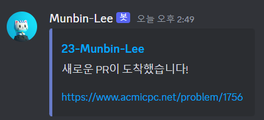

# PR-to-Discord

Sends Pull request notification message to Discord.



## Inputs

* **`discord_webhook_url`** (required): webhook URL of a Discord channel.
* **`pull_request`**: Pull request JSON string. Default is `${{ toJson(github.event.pull_request) }}`.

## Example

```yaml
name: PR to Discord

on:
  pull_request:
    types: [opened, reopened]

jobs:
  PR:
    runs-on: ubuntu-latest
    steps:
      - uses: Munbin-Lee/PR-to-Discord@main
        with:
          discord_webhook_url: ${{ secrets.DISCORD_WEBHOOK_URL }}
```
